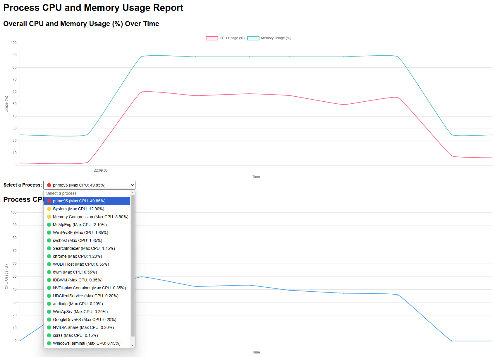

# 🚀 PC Performance Logger

**PC Performance Logger** is my **first-ever project**! 🎉 As someone who isn't a professional programmer, I was amazed by how AI tools like ChatGPT helped me create this PowerShell script. It monitors and logs your PC's CPU and RAM usage per process and software, generating a beautiful HTML report for easy analysis. 📊✨

---

## 🌟 Features

- **📈 Detailed Monitoring:** Tracks CPU and RAM usage for each active process and software.
- **⏱ Automated Logging:** Collects performance data at customizable intervals.
- **🖥 HTML Reports:** Generates interactive and visually rich reports.
- **⚙️ Easy Setup:** Simple installation and configuration with clear instructions.
- **🤖 AI-Assisted Development:** Built with the help of ChatGPT, making programming accessible to non-developers.

---

## 🛠 Installation

1. **Clone the Repository**

   ```powershell
   Set-ExecutionPolicy 
   ```

---

## 📋 Usage

Once the script is running, it will monitor your PC's CPU and RAM usage, logging the data at specified intervals. After collecting enough data, it generates an HTML report located in the `Reports` folder. 🗂️

---

## 📊 Example Report



*Replace the above path with the actual path to your report screenshot.*

---

## 🤝 Contributing

This is my **first project**, and I welcome any contributions, feedback, or suggestions to improve the script! Whether you're a seasoned developer or just starting like me, your input is valuable. 💡

1. **Fork the Project**
2. **Create Your Feature Branch**

   ```bash
   git checkout -b feature/YourFeature
   ```

3. **Commit Your Changes**

   ```bash
   git commit -m "Add some feature"
   ```

4. **Push to the Branch**

   ```bash
   git push origin feature/YourFeature
   ```

5. **Open a Pull Request**

---

## 📄 License

This project is licensed under the [MIT License](LICENSE). 📜

---

## 🙏 Acknowledgements

- **🤖 [ChatGPT](https://openai.com/chatgpt):** For providing invaluable assistance in developing the script.

---


*Thank you for checking out PC Performance Logger! I hope it helps you monitor and optimize your PC's performance effectively. This project is a testament to what anyone can achieve with curiosity and the right tools.* 🎉💪
```

